# Architecture & Flow Diagrams

## System Architecture

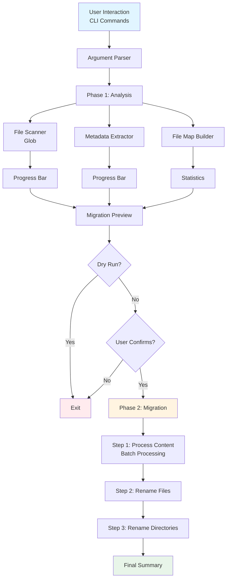

## Data Flow Diagram

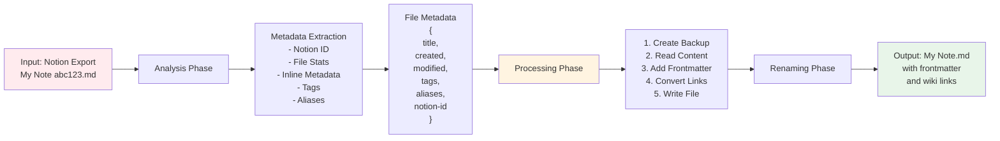

## Batch Processing Flow

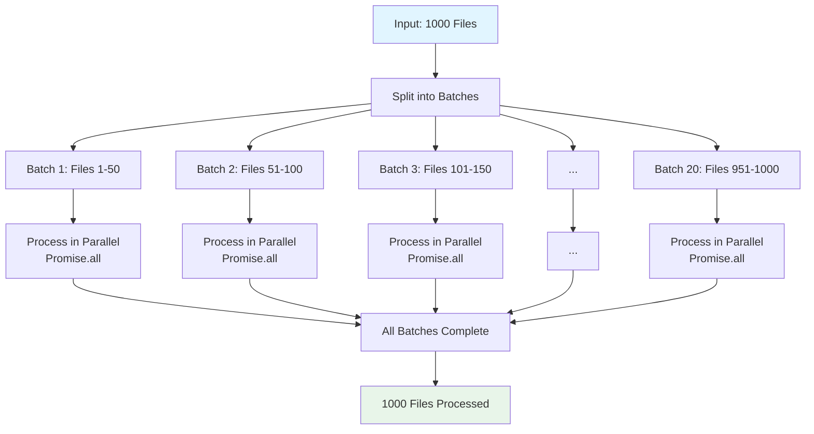

## Component Interaction Diagram

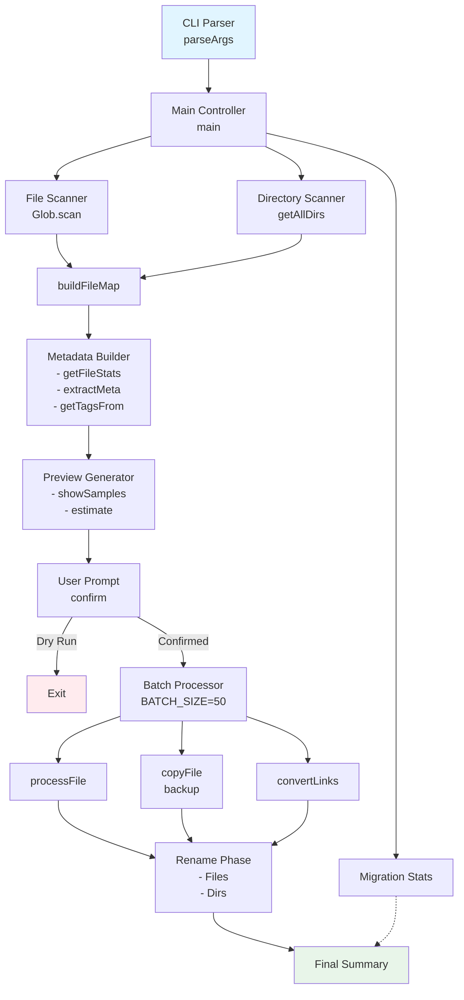

## Error Handling Flow

```mermaid
flowchart TD
    A[Operation Attempt] --> B{Try Block}
    
    B -->|Success| C[Return Success Object<br/>{success: true, data}]
    B -->|Error| D[Catch Block]
    
    D --> E[Log Error]
    E --> F[Add to Error List]
    F --> G[Return Error Object<br/>{success: false, error}]
    
    C --> H[Continue with<br/>Next Operation]
    G --> H
    
    H --> I{More Operations?}
    I -->|Yes| A
    I -->|No| J[Show Error Summary]
    
    style C fill:#e8f5e9
    style G fill:#ffebee
    style J fill:#fff4e1
```

## Performance Optimization Comparison

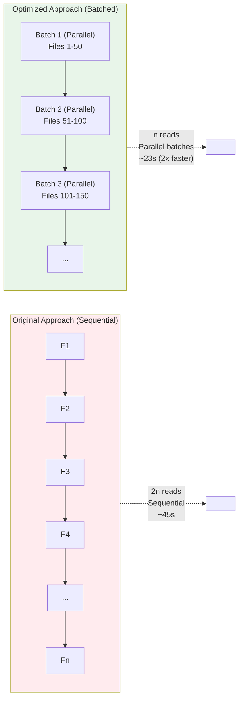

## Memory Management

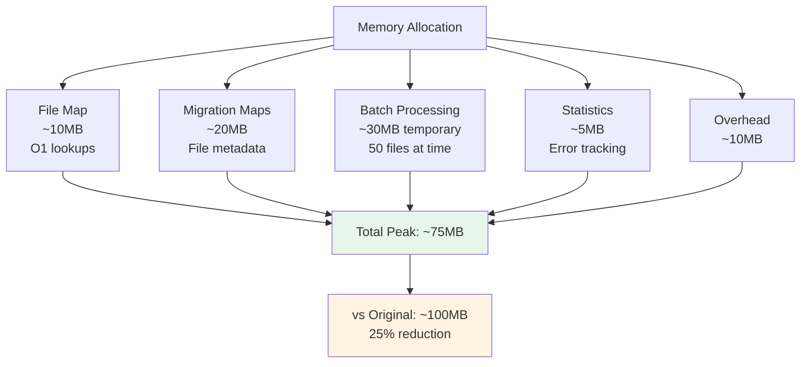

## Link Conversion Process

```mermaid
flowchart TD
    A["Input: [Link Text](My%20File%20abc123.md#section)"] --> B[Parse Markdown Link<br/>Regex Match]
    
    B --> C[Extract Components<br/>linkText: 'Link Text'<br/>linkPath: 'My%20File%20abc123.md#section']
    
    C --> D[Split Anchor<br/>path: 'My%20File%20abc123.md'<br/>anchor: 'section']
    
    D --> E[Decode URL<br/>path: 'My File abc123.md']
    
    E --> F[Clean Filename<br/>'My File abc123.md' → 'My File']
    
    F --> G{Alias Needed?}
    
    G -->|linkText ≠ filename| H[Build Aliased Link<br/>'[[My File#section|Link Text]]']
    G -->|linkText = filename| I[Build Simple Link<br/>'[[My File#section]]']
    
    H --> J[Output: Wiki Link]
    I --> J
    
    style A fill:#e1f5ff
    style J fill:#e8f5e9
```

## Statistics Tracking Flow

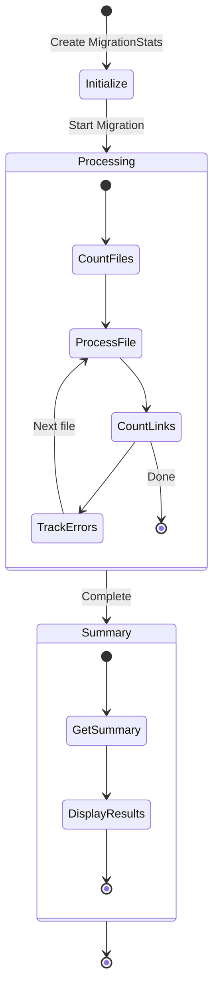

## Migration Pipeline

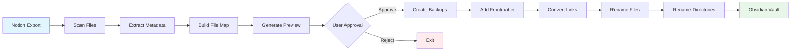

## Phase Breakdown

```mermaid
gantt
    title Migration Timeline (1000 files)
    dateFormat ss
    axisFormat %S sec
    
    section Phase 1
    File Scanning           :a1, 00, 5s
    Metadata Extraction     :a2, after a1, 8s
    Preview Generation      :a3, after a2, 2s
    
    section User
    Review & Confirm        :a4, after a3, 5s
    
    section Phase 2
    Content Processing      :b1, after a4, 15s
    File Renaming          :b2, after b1, 3s
    Directory Renaming     :b3, after b2, 2s
    
    section Complete
    Summary Display        :c1, after b3, 1s
```

## State Machine: File Processing

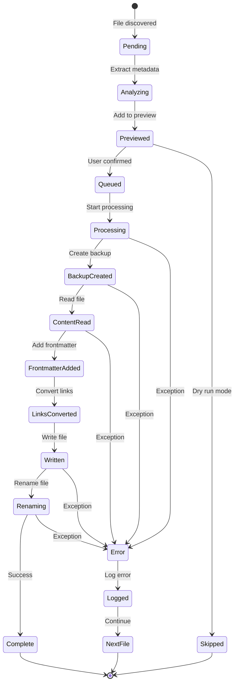

## Dependency Graph

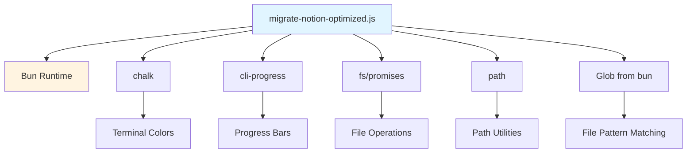

## Data Structure: File Migration Map

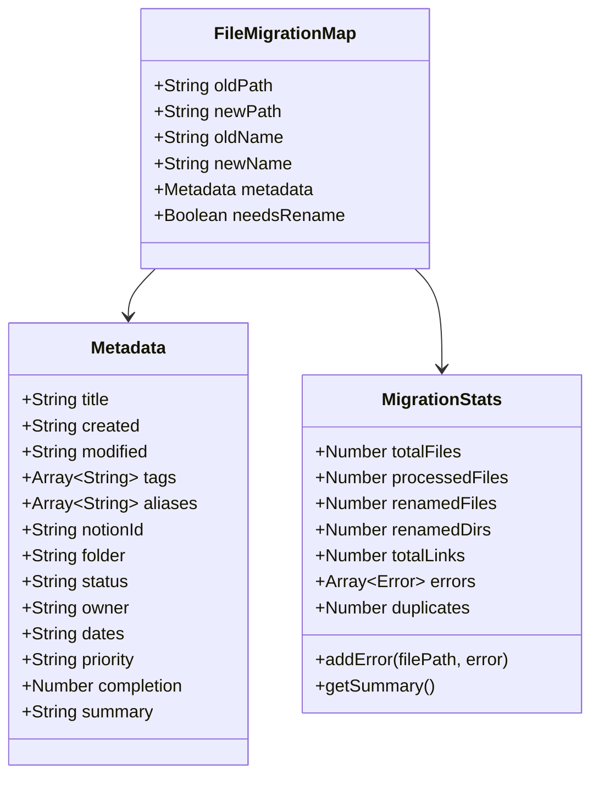

## Process Flow: Complete Migration

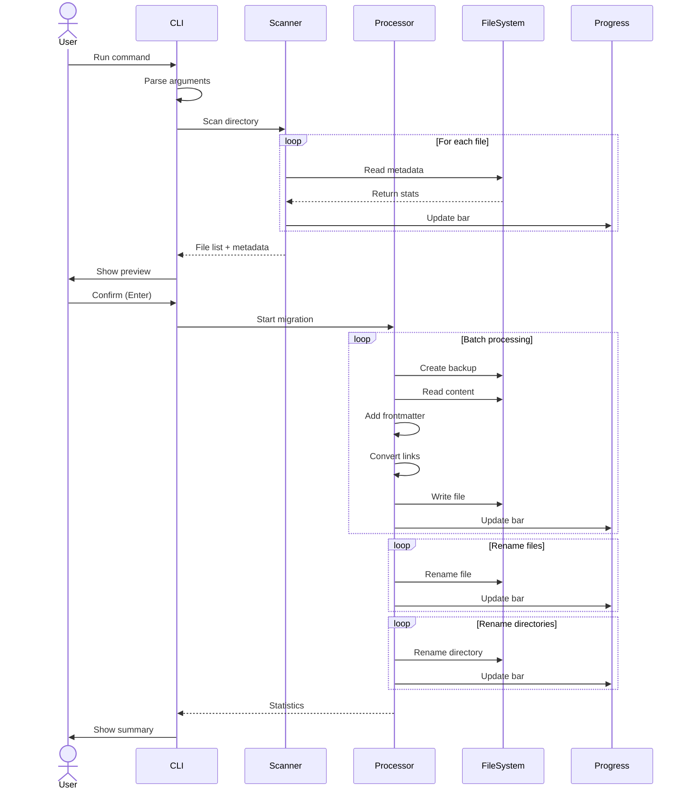

---

All diagrams are now in Mermaid format! 🎨
